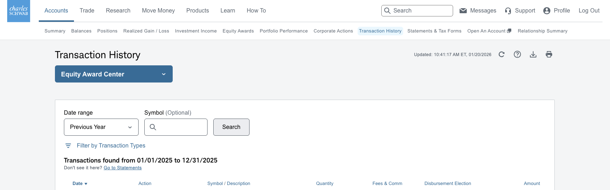

# Export of data in Charles Schwab "Equity Award Center" interface

1. Export the data from CS

To export the compatible CSV data, go to "Accounts" > "Transaction History"

- Select EAC account
- Select date range (it should be a full tax period, most likely "Previous Year")
- Click the Download icon on the top right
- Export as CSV

2. Import the downloaded ZIP file in your tax declaration, after specifying the ISIN and the  symbol ticker.
